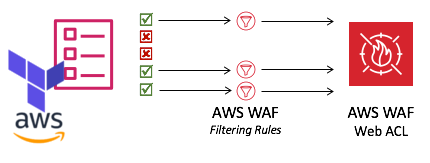
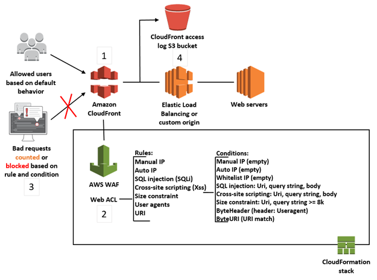

<div align="center">
    
</div>
<div align="right">
  
</div>

# Terraform | AWS WAF | OWASP Top 10 vulnerabilities

## Important
The original source was taken from https://github.com/Twinuma/terraform-waf-owasp and was adapted to the needs of the project at hand.
We've also had https://registry.terraform.io/modules/juiceinc/juiceinc-waf as reference.

## terraform-aws-waf-owasp
OWASP Top 10 Most Critical Web Application Security Risks is a powerful awareness document for web
application security. It represents a broad consensus about the most critical security risks to web applications.
Project members include a variety of security experts from around the world who have shared their expertise to
produce this list[[1]](https://www.owasp.org/index.php/Category:OWASP_Top_Ten_Project).
You can read the document that they published here: [[2]](https://www.owasp.org/images/7/72/OWASP_Top_10-2017_%28en%29.pdf.pdf).

This is a Terraform module which creates AWF WAF resources for protection of your resources from the OWASP Top 10
Security Risks. This module is based on the whitepaper that AWS provides. The whitepaper tells how to use AWS WAF
to mitigate those attacks[[3]](https://d0.awsstatic.com/whitepapers/Security/aws-waf-owasp.pdf)[[4]](https://aws.amazon.com/about-aws/whats-new/2017/07/use-aws-waf-to-mitigate-owasps-top-10-web-application-vulnerabilities/).

<div align="left">
  
</div>

### This module will create:
 1. match-sets[[5]](https://docs.aws.amazon.com/waf/latest/developerguide/web-acl-create-condition.html), to be associated with rules.
 2. rules[[6]](https://docs.aws.amazon.com/waf/latest/developerguide/web-acl-rules.html),
 3. WebACL[[7]](https://docs.aws.amazon.com/waf/latest/developerguide/web-acl-working-with.html), resources 1 and 2 cannot be used without 3.

<div align="left">
  
</div>

**NOTE:** Diagram to be taken just as reference, needs update to reflect the exact deployed resources.

References
* [1] : https://www.owasp.org/index.php/Category:OWASP_Top_Ten_Project
* [2] : https://www.owasp.org/images/7/72/OWASP_Top_10-2017_%28en%29.pdf.pdf
* [3] : https://d0.awsstatic.com/whitepapers/Security/aws-waf-owasp.pdf
* [4] : https://aws.amazon.com/about-aws/whats-new/2017/07/use-aws-waf-to-mitigate-owasps-top-10-web-application-vulnerabilities/
* [5] : https://docs.aws.amazon.com/waf/latest/developerguide/web-acl-create-condition.html
* [6] : https://docs.aws.amazon.com/waf/latest/developerguide/web-acl-rules.html
* [7] : https://docs.aws.amazon.com/waf/latest/developerguide/web-acl-working-with.html


## Use AWS WAF at terraform to Mitigate OWASP’s Top 10 Web Application Vulnerabilities
* Global WAF for CloudFront usage
* Regional WAF for Regional/ALB usage

**For more information:**
* AWS Blog - https://aws.amazon.com/about-aws/whats-new/2017/07/use-aws-waf-to-mitigate-owasps-top-10-web-application-vulnerabilities/
* AWS Whitepaper - https://d0.awsstatic.com/whitepapers/Security/aws-waf-owasp.pdf

## Examples
### waf-regional
#### waf-regional-alb
```terraform
module "waf_regional_test" {
    source = "git::git@github.com:binbashar/terraform-aws-owasp.git//modules/waf-regional?ref=v0.0.1"

    # Just a prefix to add some level of organization
    waf_prefix = "test"
    
    # List of IPs that are blacklisted
    blacklisted_ips = []
    
    # List of IPs that are allowed to access admin pages
    admin_remote_ipset = []
    
    # Pass the list of ALB ARNs that the WAF ACL will be connected to
    alb_arn = [
        "arn:aws:elasticloadbalancing:us-east-2:1234567890:loadbalancer/app/some-LB-ABCD1233/12345678"
    ]
    
    # Use COUNT for test, then you can use BLOCK (by default)
    rule_action_type = "COUNT"
}
```

### waf-global
#### waf-global-cloudfront
```terraform
module "waf_regional_test" {
    source = "git::git@github.com:binbashar/terraform-aws-owasp.git//modules/waf-global?ref=v0.0.1"

    # Just a prefix to add some level of organization
    waf_prefix = "test"

    # List of IPs that are blacklisted
    blacklisted_ips = []

    # List of IPs that are allowed to access admin pages
    admin_remote_ipset = []

    # Pass the list of CloudFront distribution ARNs that the WAF ACL will be connected to
    cloudfront_arn = [
        "arn:aws:cloudfront::123456789012:distribution/EDFDVBD632BHDS5"
    ]

    # Use COUNT for test, then you can use BLOCK (by default)
    rule_action_type = "COUNT"
}
```